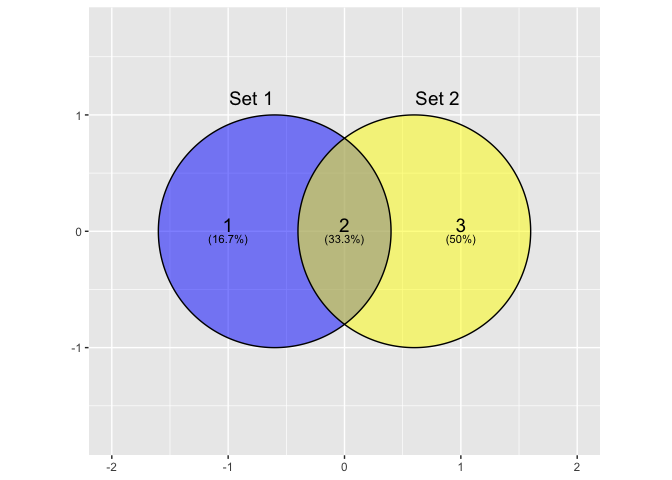
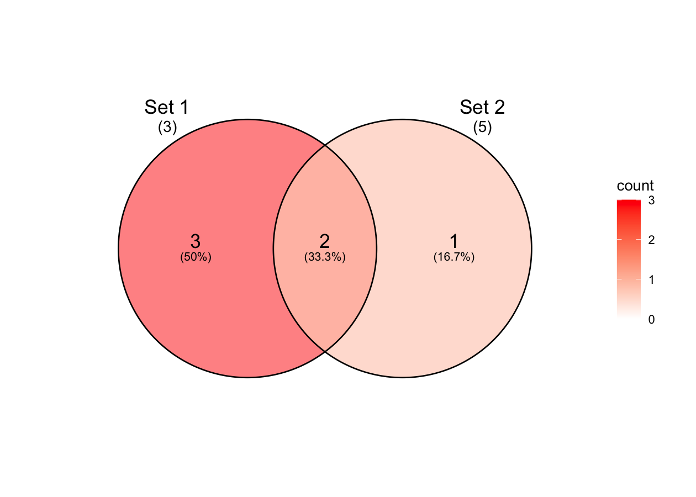
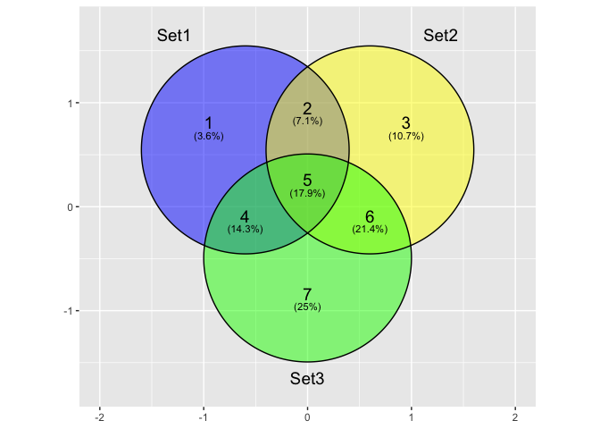
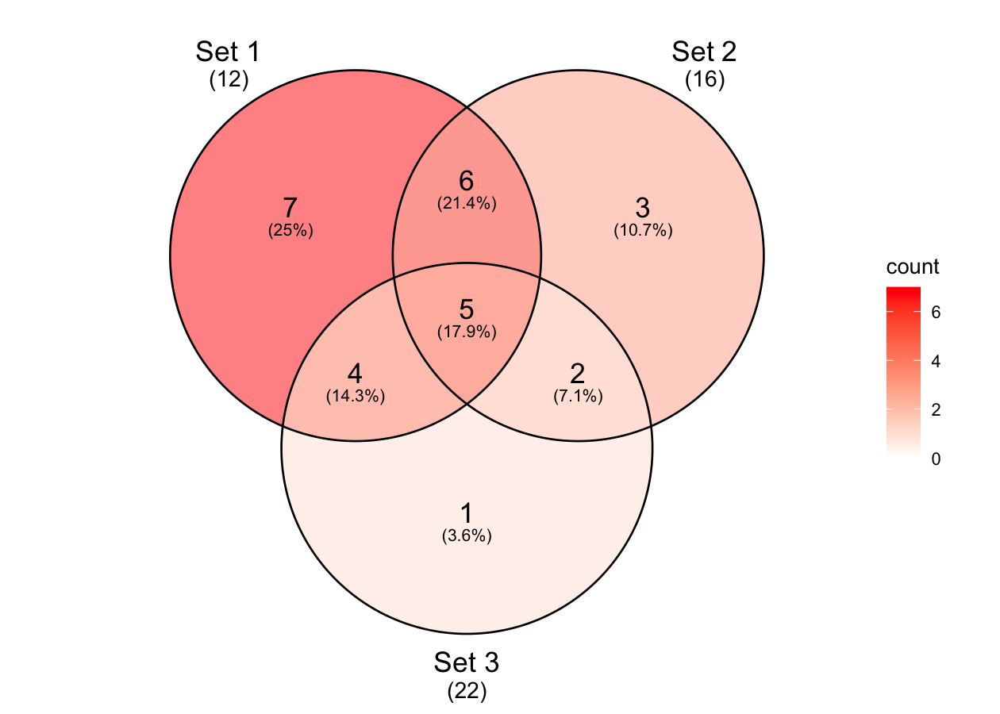
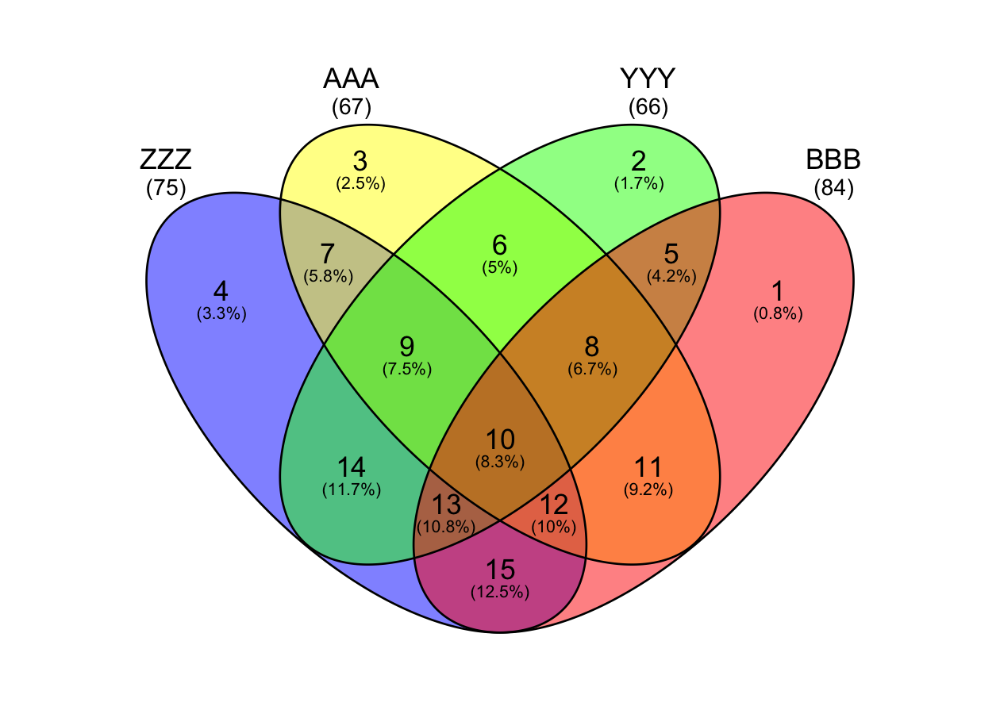
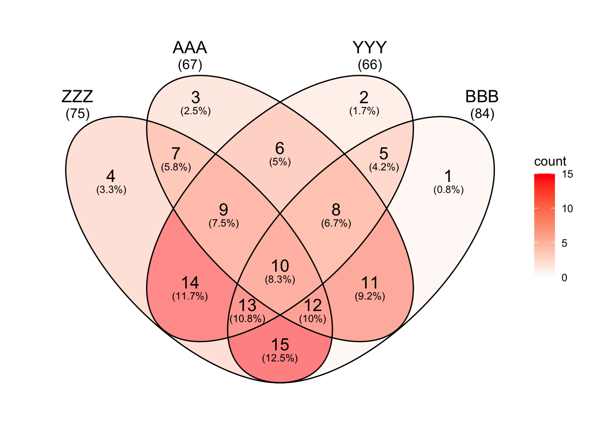

<!-- README.md is generated from README.Rmd. Please edit that file -->

# ggvd

<!-- badges: start -->
<!-- badges: end -->

Another implementation of Venn diagrams in
[ggplot2](https://github.com/tidyverse/ggplot2/). Simple functions to
generate 2-4 way Venn diagrams using ‘ggplot2’ with minimal
dependencies.

Takes the good parts of [ggvenn](https://github.com/yanlinlin82/ggvenn)
and [ggVennDiagram](https://github.com/gaospecial/ggVennDiagram).

``` r
library(ggvd)
## Loading required package: ggplot2
```

``` r
# 2 way Venn
ls2 <- list("Set 1" = c(1, 2:3), "Set 2" = c(2:3, 4:6))
venn2 <- prepare_venn(ls2, fill = c("blue", "yellow"))

# discrete
ggplot() +
  geom_venn(aes(set_name = set_name, elements = elements, fill = fill),
            data = venn2, type = "discrete", set_total = TRUE) +
  scale_fill_identity() + 
  scale_color_identity() + 
  theme_void()

# continuous
ggplot() +
  geom_venn(aes(set_name = set_name, elements = elements, fill = count),
            data = venn2, type = "continuous", set_total = TRUE) +
  scale_fill_gradient(low = "white", high = "red") + 
  theme_void()
```



``` r
# 3 way Venn
ls3 <- list("Set 1" = c(1,2:3,7:10,11:15), 
            "Set 2" = c(2:3,4:6,11:15,16:21), 
            "Set 3" = c(7:10,11:15,16:21,22:28))
venn3 <- prepare_venn(ls3, fill = c("blue", "yellow", "green"))

# discrete
ggplot() +
  geom_venn(aes(set_name = set_name, elements = elements, fill = fill),
            data = venn3, type = "discrete", set_total = TRUE) +
  scale_fill_identity() + 
  theme_void()

# continuous
ggplot() +
  geom_venn(aes(set_name = set_name, elements = elements, fill = count),
            data = venn3, type = "continuous", set_total = TRUE) +
  scale_fill_gradient(low = "white", high = "red") + 
  theme_void()
```



``` r
# 4 way Venn
ls4 <- list("ZZZ" = c(1,11:15,29:36,46:55,56:66,67:78,79:91,106:120),
            "AAA" = c(2:3,11:15,16:21,29:36,37:45,46:55,79:91,92:105),
            "YYY" = c(4:6,16:21,22:28,29:36,37:45,46:55,56:66,67:78),
            "BBB" = c(7:10,22:28,37:45,46:55,67:78,79:91,92:105,106:120))
venn4 <- prepare_venn(ls4, fill = c("blue", "yellow", "green", "red"))

# discrete
ggplot() +
  geom_venn(aes(set_name = set_name, elements = elements, fill = fill),
            data = venn4, type = "discrete", set_total = TRUE) +
  scale_fill_identity() + 
  theme_void()

# continuous
ggplot() +
  geom_venn(aes(set_name = set_name, elements = elements, fill = count),
            data = venn4, type = "continuous", set_total = TRUE) +
  scale_fill_gradient(low = "white", high = "red") + 
  theme_void()
```


