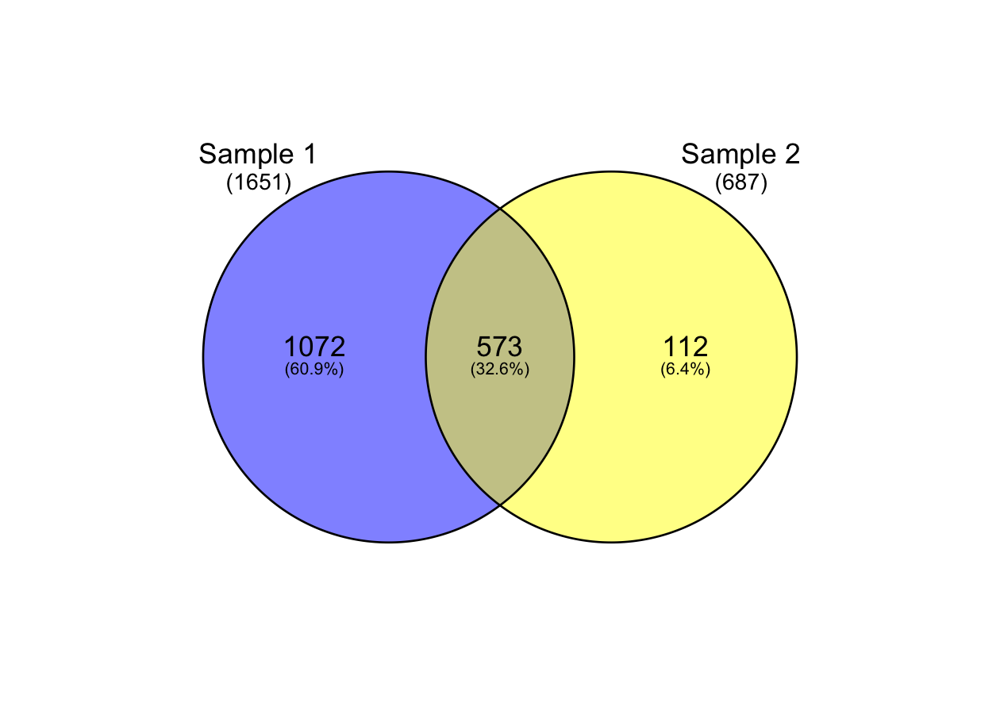
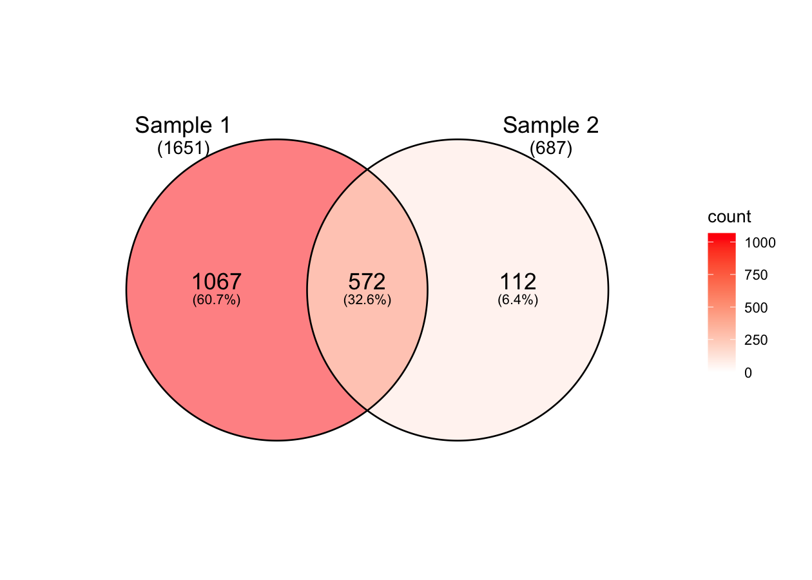
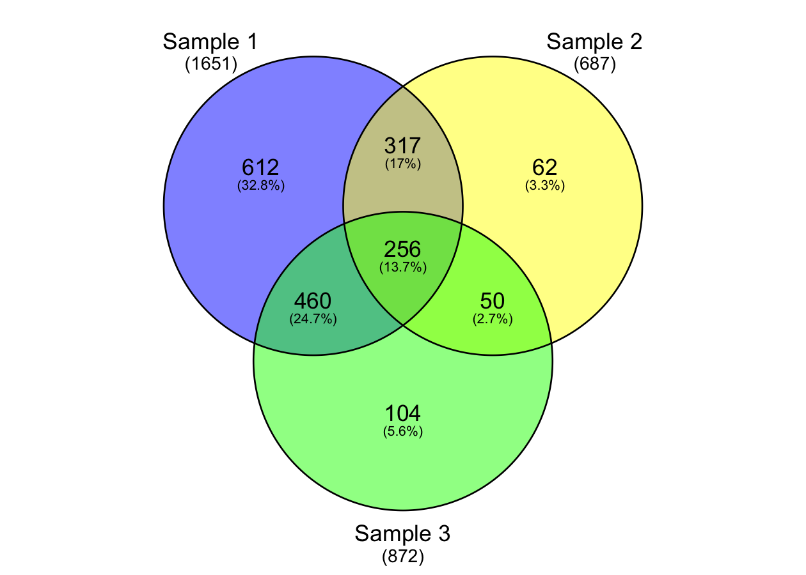
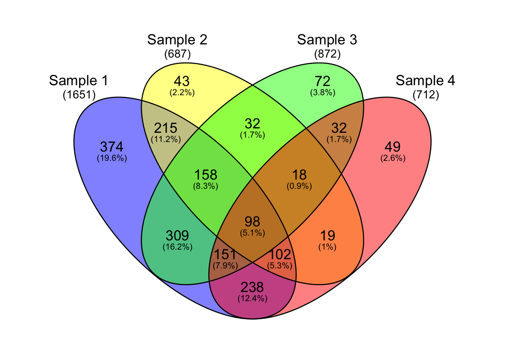
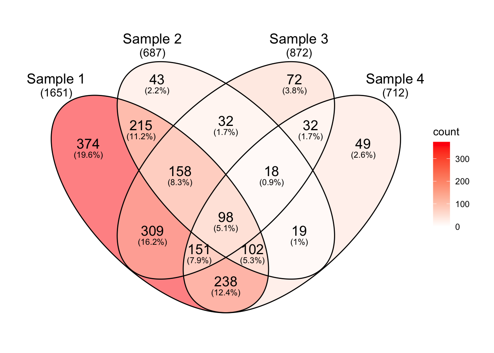

<!-- README.md is generated from README.Rmd. Please edit that file -->

# ggvd

<!-- badges: start -->
<!-- badges: end -->

Another implementation of Venn diagrams in
[ggplot2](https://github.com/tidyverse/ggplot2/). Simple functions to
generate 2-4 way Venn diagrams using ‘ggplot2’ with minimal
dependencies.

Takes the good parts of [ggvenn](https://github.com/yanlinlin82/ggvenn)
and [ggVennDiagram](https://github.com/gaospecial/ggVennDiagram).

``` r
library(ggplot2)
library(ggvd)
```

``` r
# make some fake data
generate_gene_names <- function(n) {
  gene_letters <- do.call(
    paste0, 
    replicate(3, sample(LETTERS, n, replace = TRUE), simplify = FALSE)
  )
  paste0(gene_letters, sample.int(9, n, replace = TRUE))
}

genes <- generate_gene_names(n = 2000)
```

``` r
# input for venn should be a list
set.seed(42)
results <- list(
  "Sample 1" = sample(genes, 1651),
  "Sample 2" = sample(genes, 687),
  "Sample 3" = sample(genes, 872),
  "Sample 4" = sample(genes, 712)
)
```

``` r
# prepare_venn takes a list and outputs a data.frame in the correct format
venn2 <- prepare_venn(results[1:2], fill = c("blue", "yellow"))
venn3 <- prepare_venn(results[1:3], fill = c("blue", "yellow", "green"))
venn4 <- prepare_venn(results, fill = c("blue", "yellow", "green", "red"))
```

``` r
## 2 way Venn

# discrete
ggplot() +
  geom_venn(aes(set_name = set_name, elements = elements, fill = fill),
            data = venn2, type = "discrete", set_total = TRUE) +
  scale_fill_identity() + 
  scale_color_identity() + 
  theme_void()

# continuous
ggplot() +
  geom_venn(aes(set_name = set_name, elements = elements, fill = count),
            data = venn2, type = "continuous", set_total = TRUE) +
  scale_fill_gradient(low = "white", high = "red") + 
  theme_void()
```



``` r
## 3 way Venn

# discrete
ggplot() +
  geom_venn(aes(set_name = set_name, elements = elements, fill = fill),
            data = venn3, type = "discrete", set_total = TRUE) +
  scale_fill_identity() + 
  scale_color_identity() + 
  theme_void()

# continuous
ggplot() +
  geom_venn(aes(set_name = set_name, elements = elements, fill = count),
            data = venn3, type = "continuous", set_total = TRUE) +
  scale_fill_gradient(low = "white", high = "red") + 
  theme_void()
```



``` r
## 4 way Venn

# discrete
ggplot() +
  geom_venn(aes(set_name = set_name, elements = elements, fill = fill),
            data = venn4, type = "discrete", set_total = TRUE) +
  scale_fill_identity() + 
  scale_color_identity() + 
  theme_void()

# continuous
ggplot() +
  geom_venn(aes(set_name = set_name, elements = elements, fill = count),
            data = venn4, type = "continuous", set_total = TRUE) +
  scale_fill_gradient(low = "white", high = "red") + 
  theme_void()
```


